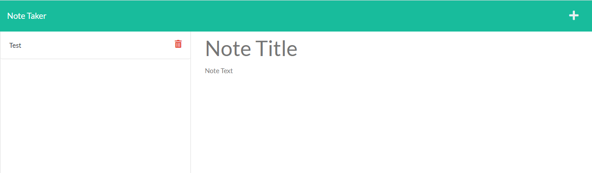

# Note-Taker

## Description

This is an application that writes and saves notes to organize and keep track of tasks. When you click on the link to the notes page you are presented with a page with existing notes listed in the left-hand column, plus empty fields to enter a new note title and the note’s text in the right-hand column. WhenI click on the Save icon
then the new note is saved and appears in the left-hand column with the other existing notes. When you click on the red trash can for a given note, it is deleted.

## Built With

- HTML
- CSS
- Javascrip
- Node.js
- Express.js

## Website

- Deployed with Heroku

https://note-app-ajp.herokuapp.com/

## ScreenShot

